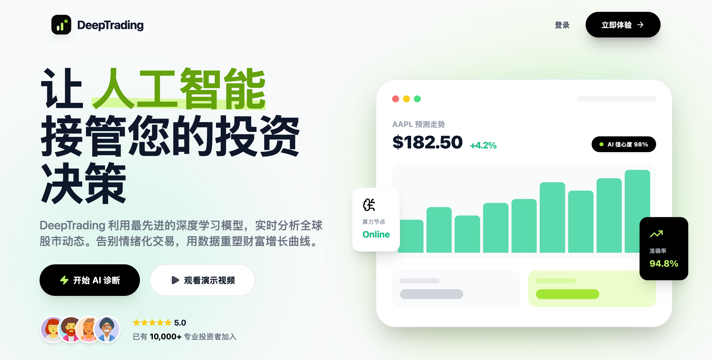
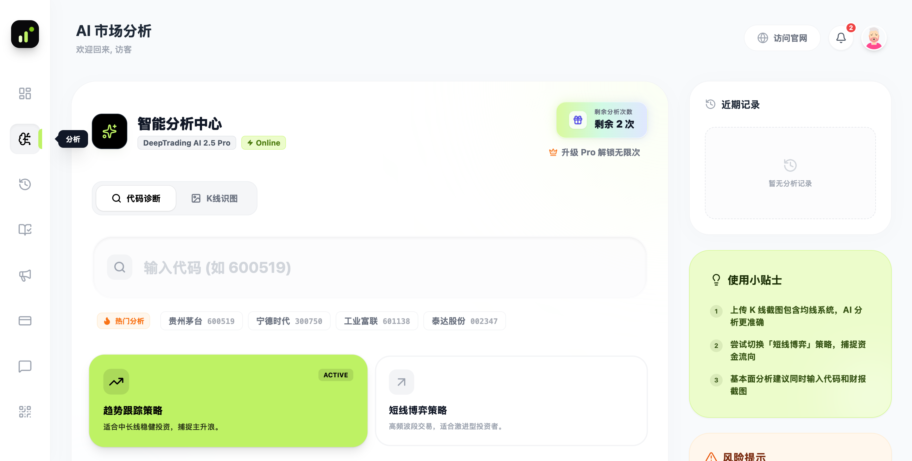
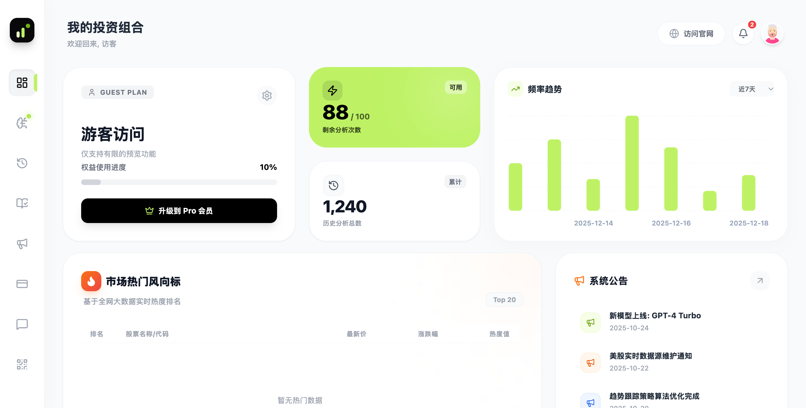
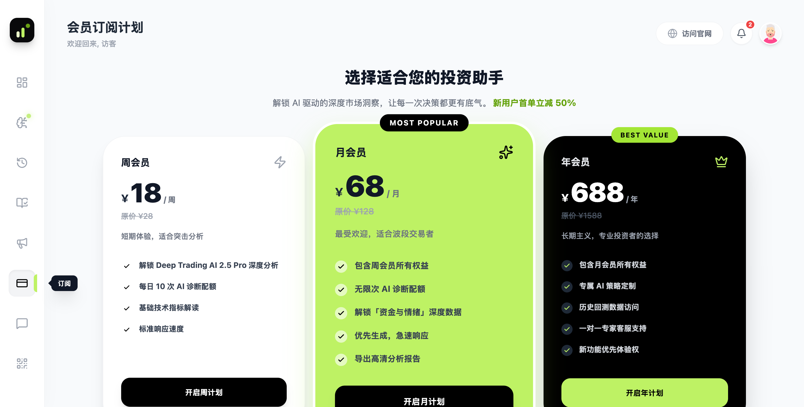

<div align="center">

# 📈 DeepTrading AI

**让 AI 接管您的投资决策 —— AI 驱动的智能股票分析平台**

[](https://deeptrading.top)
[](https://react.dev)
[](https://www.typescriptlang.org)
[](https://ai.google.dev)

</div>

---

DeepTrading AI 是一个面向 **A 股 / 港股 / 美股** 个人投资者的 AI 股票分析应用。输入股票代码，或直接上传一张 K 线截图，AI 会以资深金融分析师的视角生成一份**结构化的中文分析报告**：买卖建议、技术指标解读、入场区间与止盈止损策略，一应俱全。

> 🌐 **在线访问**：[https://deeptrading.top](https://deeptrading.top)

## ✨ 界面预览

| 落地页 | AI 市场分析 |
| :---: | :---: |
|  |  |
| **仪表盘** | **会员订阅** |
|  |  |

## 🧠 核心功能

### AI 智能诊断（双模式输入）

- **代码诊断**：输入股票代码（如 `600519` 贵州茅台），AI 结合自身金融知识生成诊断报告
- **K 线识图**：上传 K 线截图，AI 进行多模态识图分析——均线上下、趋势结构、量价关系尽收眼底
- **双策略引擎**：
  - 📈 **趋势跟踪策略** —— 适合中长线稳健投资，捕捉主升浪
  - ⚡ **短线博弈策略** —— 高频波段交易，适合激进型投资者

### 结构化分析报告

基于 Gemini 结构化输出（`responseSchema` 强约束），每次分析稳定产出：

- 🎯 **买卖建议**：买入 / 卖出 / 观望 三档结论 + AI 置信度评分
- 📊 **技术指标解读**：RSI、MACD、布林带、成交量、趋势强度逐项定性分析
- 💰 **资金与情绪推断**：资金流向、散户情绪定性判断
- 📍 **交易计划**：入场区间、止盈位、止损位，并附完整策略逻辑说明

### 报告管理与导出

- 🗂 **历史分析档案**：支持按「买入 / 卖出 / 观望」筛选与关键词搜索
- 🖼 **报告导出**：一键将分析报告导出为高清 PNG 图片，方便分享与存档（Pro 会员）
- 👥 **会员体系**：游客体验 → Free（每日 1 次分析）→ Pro（无限次 + 高清导出）分级权益

## 🛠 技术栈

| 层级 | 技术 |
| --- | --- |
| 前端框架 | React 19 + TypeScript + Vite 6 |
| UI / 样式 | Tailwind CSS、lucide-react，Plus Jakarta Sans 字体 |
| 图表 | Recharts（使用频率柱状图、情绪分布等） |
| AI 引擎 | Google **Gemini 2.5 Flash**（`@google/genai` SDK，JSON Schema 结构化输出） |
| 图片导出 | html2canvas |
| 部署 | 纯静态构建产物，已部署至 [deeptrading.top](https://deeptrading.top) |

**架构说明**：本项目为纯前端 SPA，浏览器端直接调用 Gemini API，无需自建后端。AI 输出经由严格的 `responseSchema` 约束，保证报告字段结构稳定、可直接渲染。

```
用户输入（股票代码 / K线截图）
        │
        ▼
策略模式选择（趋势跟踪 / 短线博弈）
        │
        ▼
Gemini 2.5 Flash（结构化 JSON 输出 + 金融分析师系统指令）
        │
        ▼
分析报告渲染（建议 / 指标 / 交易计划）──► 历史档案 / PNG 导出
```

## 🚀 快速开始

**前置要求**：Node.js 18+

```bash
# 1. 安装依赖
npm install

# 2. 配置 Gemini API Key（在 https://aistudio.google.com 免费获取）
echo "GEMINI_API_KEY=你的Key" > .env.local

# 3. 启动开发服务器
npm run dev
```

访问 `http://localhost:3000` 即可使用。生产构建：`npm run build`，产物为纯静态文件，可部署到任意静态托管服务。

> ⚠️ **安全提示**：本架构将 API Key 编译进前端 bundle，适合本地开发与个人使用。若需公开部署，建议将 Gemini 调用迁移至后端代理，避免 Key 泄露。

## 🗺 Roadmap

- [ ] 接入实时行情数据源（当前行情数据为演示数据）
- [ ] 后端服务化：用户系统、API Key 代理、分析记录云端持久化
- [ ] 技术指标量化计算（当前由 AI 模型定性分析）
- [ ] 自选股监控与信号推送

## ⚠️ 免责声明

本项目所有 AI 生成内容（包括买卖建议、目标价位、策略分析）**均不构成任何投资建议**。股市有风险，投资需谨慎。AI 分析基于模型推理，可能存在错误或偏差，任何投资决策请以个人独立判断为准，据此操作风险自负。

---

<div align="center">

**DeepTrading AI** · Built with React & Gemini

</div>
